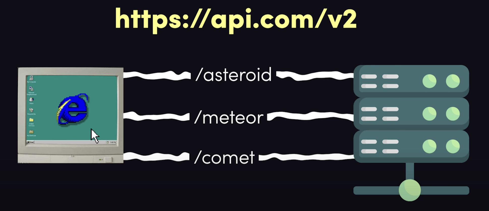
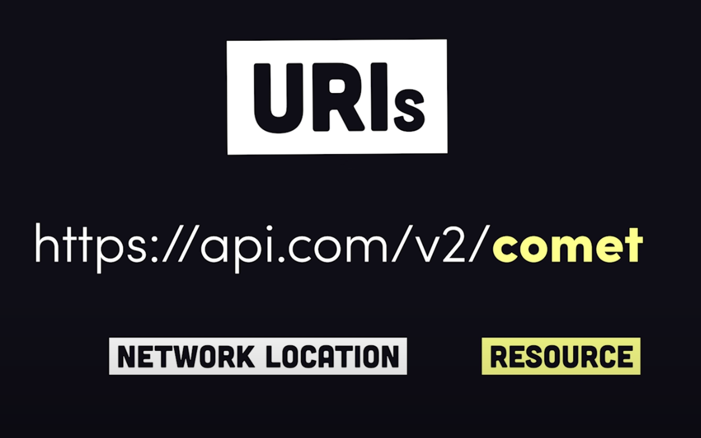

# An Introduction to Web APIs

Web APIs are a key concept tha we encounter throughout all of the data and software world. Using and building APIS are some of the most useful tools in your data toolkit.

## What is an API?

API = Application Programming Interface

- Disambiguation: APIs in general are a set of rules defining how computers or software should communicate with each other. In this context, we are specifically referring to a web API, which is just a set of rules defining how computers talk to each other over a network like the internet.
- Using a web API is exactly like interacting with a website, but you programmatically access the data and resources of a website without having to click the front end components and buttons.
- Most APIs are RESTful (REST = Representational State Transfer)
  - A RESTful API organise data entities or resources onto unique URIs (endpoint) \
    
  - client makes a request to an endpoint over HTTP \
    

See this excelent fireship [video](https://www.youtube.com/watch?v=-MTSQjw5DrM) for a more in-depth explanation.

## When might you want to use an API

- Querying, modifying and maintaining a persitent storage layer.
- Running a complex process.
- Performing an action on your behalf that only they are allowed to do.

### Examples

- ISS
- Monzo
- Wolfram Alpha
- Google Maps
- Github
- IBM Watson
